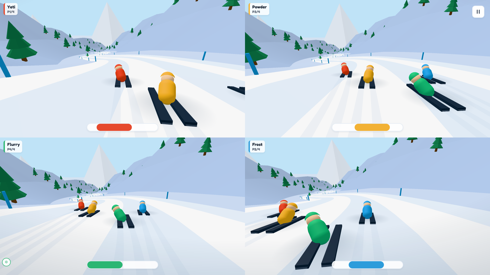

# Powder Party

Multiplayer downhill ski racing where phones become **tilt + swipe** controllers and a
shared screen is the slope. A couch party game for 1–4 players on one display.



**▶ [Play it live](https://powder.couch-games.com/)** · **[UI gallery](https://powder-main.couch-games.com/gallery.html)**

## The idea

The big screen renders the mountain; each player joins by scanning a QR code with their
phone and races down the piste. Everything is **eyes-free** — you watch the TV, not your
hand:

You're **tucked and fast by default** — you only touch the pad to do something deliberate:

| Input | Action |
|---|---|
| **Tilt** the phone left/right | **Carve** left/right (gyro roll) |
| *(rest — nothing)* | **Tuck** — the default: squat for speed (soft steering) |
| **Touch & hold** (anywhere) | **Brake** — sit up to scrub speed and carve hard (corners, trees) |
| **Flick in the air** (any direction) | A **trick** — the angle picks it: up = back flip, down = front, sides = spin, diagonals = cork. Land it clean for a small boost; land mid-rotation and you wash out |

There's **no jump button**: ramps **auto-launch** you when you ski over the lip — the faster you
hit it, the bigger the air.

The core loop: **rip the straights** tucked, **hold to brake** into the bends and around the
trees, **hit the ramps** for air, and **flip** off the big jumps for a
boost — but only if you have the air to finish the rotation. First skier to the bottom wins.
Short-handed lobbies are topped up with CPU skiers so a solo player still races.

## Architecture

Same display-authoritative model as the sibling games (Tiny-Track-Party, HexStacker-Party):
the **display browser runs the authoritative simulation** and renders it with Three.js; the
Node server only serves static files + a QR/JSON API (no game logic, no WebSocket). Phones are
thin controllers. Game events flow display → relay → controllers over a
[Party-Sockets](https://github.com/tim4724/Party-Sockets) WebSocket relay; the hot-path
`CONTROL` input (`{s: carve, t: tuck/brake, j: up-flick edge, f: air-flick edge}`) rides a low-latency WebRTC fastlane with
relay fallback. The transport kit (`partyplug/`) and Three.js (`vendor/`) are reused verbatim
from the sibling games.

## Quick start

```bash
npm install
npm start            # http://localhost:4000  (PORT env overrides)
```

1. Open the display URL on a big screen.
2. Players scan the QR code with their phones to join.
3. The first player to join is the host and starts the run from their phone.
4. Tilt to carve, touch & hold to brake, and in the air flick **any direction** to pull a trick (the
   angle picks it — up/down flip, sides spin, diagonals cork; ramps launch you). First to the bottom wins.

> Phones need **HTTPS** for the tilt sensors — front the server with a tunnel or TLS cert when
> testing on real devices. The display works over plain HTTP, and desktop keyboard fallback
> (A/D carve · hold S brake · ↑/Space back flip · ↓ front · Q/E spin · Z/C corks) lets you test
> without a phone.

### No-phone preview

The display page drives itself from fake data with `?test=1&scenario=…` (no relay needed).
No need to hand-build these URLs: the ⚙ button bottom-left on the display opens a debug menu
that sets every param below interactively. (The controller has no debug menu — it's a
player-facing surface; use the gallery or the URLs below to preview its screens.)

- `/?test=1&scenario=running&players=4` — full split-screen run, CPU-driven (endless loop)
- `/?test=1&scenario=results` — the results board
- `/?test=1&scenario=lobby` — orbiting slope preview + fake roster
- `/?test=1&scenario=slope` — clean orbiting slope preview, CPU field (no overlays)
- `/?test=1&scenario=tricks` — **drive skier 0 from the keyboard** beside the ramps to feel the
  brake/flip loop (A/D carve · hold S brake · ↑/Space back flip · W/↓ front · Q/E spin · Z/C corks)
- `/?scenario=solo` — **play single player on the big screen, no phone**: a real race down a
  generated mountain against a CPU field, you in a full-screen chase cell. Keyboard: A/D carve ·
  hold S brake · Q spin-left · W front flip · E spin-right · Space back flip (Z/C corks). The
  finish holds the results board — Enter (or "Play again") skis a FRESH mountain at the same
  difficulty. `&players=N` sizes the field (default you + 3 CPU), `&seed=N` pins one mountain
  (every rematch replays it, for repro) and `&level=blue|red|black` sets the grade.
- `/?test=1&scenario=countdown` · `…&scenario=paused`
- `/?test=1&scenario=device-choice&bail=game_ended` — the chooser a phone gets when it lands on
  this big-screen page (shared link, or a controller bailing out of a dead end with `?bail=…`;
  toast reasons: `game_ended`, `room_not_found`, `game_full`)

The phone controller previews a single screen the same way, off the relay:
`/controller/index.html?scenario=playing&color=2` (scenarios: `name`, `name-connecting`,
`lobby-host`, `lobby-waiting`, `late-join` (run in progress without you), `countdown`,
`playing`, `brake`, `paused`, `finished`, `results` (host), `results-waiting` (non-host),
`results-join` (late joiner's board), `conn-reconnecting` / `conn-lost` /
`conn-display-gone` / `conn-replaced` (the relay-link overlay states); `color` 0–7
picks the livery).

### Gallery

A no-relay preview surface that tiles every screen as a scaled iframe of the real page (each
driven by its `TestHarness`), so UI regressions are visible at a glance. Four tabs:

- `/gallery.html` — **Display**: every big-screen state (lobby → countdown → run → paused →
  results) across aspect ratios (16:9 / 21:9 / 4:3 / 1:1) and skier counts.
- `/gallery-controller.html` — **Phone**: every controller screen across device sizes,
  orientation, and "browser chrome" on/off, with a "view as" picker to preview all liveries.
- `/gallery-slopes.html` — **Slopes**: one orbiting card per slope in `shared/slopes.js`,
  with an optional centerline overlay.
- `/gallery-sounds.html` — **Sounds**: one card per SFX, played through the real
  `SlopeAudio` synth and labelled with the game event that fires it.

## Project structure

```
server/index.js            # static host + QR/JSON API (no game logic)
public/
  shared/protocol.js       # wire contract (MSG vocabulary, livery palette) — classic <script>
  shared/slopes.js         # slope catalog (dependency-free data)
  shared/theme.css         # shared design tokens + component kit
  display/                 # the big screen (authoritative)
    engine/SkiEngine.js    #   pure ribbon-follow ski sim (Node-testable, no THREE)
    SlopeBuilder.js        #   procedural descending centerline from slope pieces
    Centerline.js          #   open Catmull-Rom path sampler
    RunSession.js          #   lifecycle (countdown / run / finish / pause)
    AiDriver.js            #   pure-pursuit CPU skiers
    SceneRenderer.js       #   Three.js slope + skiers + split-screen chase cams
    Audio.js               #   Web-Audio synth SFX (wind / jumps / crashes / poles)
    Net.js, main.js        #   relay + lobby + game loop
    TestHarness.js         #   no-relay preview scenarios
  controller/              # the phone (tilt + swipe)
    TiltInput.js           #   gyro → carve
    SwipeInput.js          #   hold → brake, flick (in the air) → trick
    Net.js, main.js, ui.js
  gallery*.{html,js}       # no-relay preview gallery (Display / Phone / Slopes / Sounds tabs)
  gallery.css              #   shared gallery chrome
partyplug/                 # reusable party-game transport kit (served under /partyplug/)
vendor/three/              # vendored Three.js (served under /vendor/)
tests/                     # SkiEngine + slope-generator unit tests (node:test)
scripts/capture-artwork.js # headless 4-player split-screen hero shot → artwork/ (Playwright)
```

## Testing

```bash
npm test          # node:test — SkiEngine physics + partyplug transport
npm run test:e2e  # Playwright — real display + phone pages over the real relay
```

The engine is THREE-free so the unit tests feed it a lightweight centerline stub and assert on
the physics: gravity descent + finish, the tuck speed gain, carve-scrub, tree wipeouts,
jumps + ramp auto-launch, air flips (land clean for a boost, land mid-flip and wash out, the
min-air gate), ranking, and skier removal.

The E2E suite (`tests/e2e`) drives the REAL pages end to end — the display page creates a live
room on the relay, controller pages join it by room code at phone viewport, and runs are
skipped with the display's own fast-forward lever (real physics, real broadcasts). It covers
the full lifecycle (start → results → play again → new game), the late-join flow (waiting
screen → "next run" board rows → rematch fold-in), same-device rejoin mid-run and during
results, and the device-choice screen with its bail toasts (stale room via the boot probe,
full room, back-gesture restore). One-time setup: `npx playwright install chromium`.

## Tuning

The feel constants are starting values, grouped and commented at the top of `SkiEngine.js`
(speed/tuck/carve/jump) and `SceneRenderer.js` (camera). The slope layout — pitches, bends,
ramp + tree placement — is plain data in `shared/slopes.js`.

## Tech stack

- **Runtime:** Node.js (static host, no build step, no bundler, no framework)
- **3D:** Three.js (vendored)
- **Relay:** Party-Sockets WebSocket relay (signaling + game events) + WebRTC fastlane for input
- **Frontend:** vanilla JavaScript + ES modules
